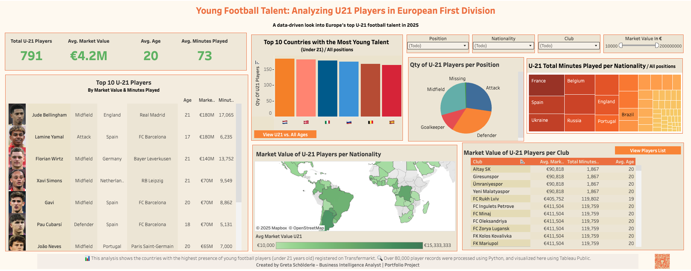
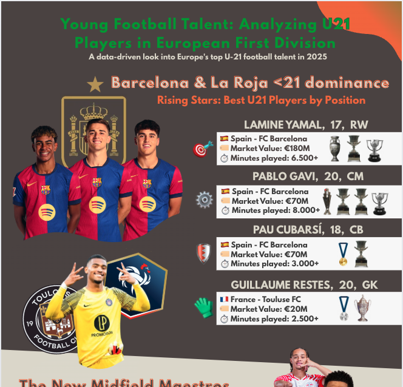
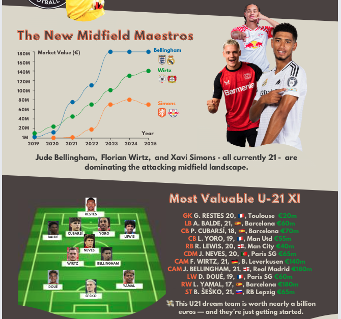
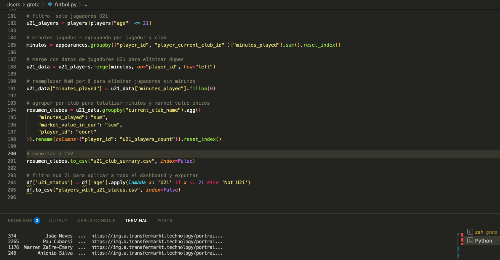

# u21-football-dashboard
Analysis of U-21 football players in European First Division

This is a data visualization project developed using Python, Tableau Public, and Figma. It explores the market value and characteristics of the most valuable football players under 21 (U-21) in 2025, based on data from Transfermarkt.

⸻

### Project Overview

This project is part of my data portfolio and was carried out in three main phases:

1. Data Processing with Python
	•	I cleaned and transformed raw player data extracted from Transfermarkt.

	•	Irrelevant rows were removed, columns were renamed, and additional metrics were calculated, such as:

	•	Age

	•	Total minutes played

	•	Market value in euros

	•	I applied a filter to select only U-21 players (including those who have already turned 21).

	•	Aggregations were created to analyze data per club and league.

3. Interactive Dashboard with Tableau
	•	I built an interactive dashboard to visualize:

	•	Average and total market value, minutes played, and age of U-21 players by club, nationality, and by position

	•	Total minutes played by young players

	•	Historical market value growth of top talents

	•	I focused on clarity and structure, aiming for accessible insights.
	
[▶️ View the Tableau Dashboard]([https://public.tableau.com/app/profile/greta8355/viz/Futbol_197447386490570/Dashboard](https://public.tableau.com/views/Futbol_17447386490570/Dashboard?:language=es-ES&:sid=&:redirect=auth&:display_count=n&:origin=viz_share_link))

3. Visual Summary
	•	I created an infographic summarizing key findings.

	•	It features the Ultimate U-21 XI, including:

	•	Player names, ages, nationalities, clubs, and individual market values

	•	An ideal U-21 squad according to the players market value and minutes played

### Repository Contents
	•	futbol.py – Python script used to clean and analyze the dataset
	•	players.csv – Processed dataset with player stats
	•	README.md – This file
	•	/img/ – Folder with screenshots of the dashboard and infographic

### Screenshots

### Tableau Dashboard

### U-21 Starting XI Infographic Closeup

### U-21 Starting XI Infographic Closeup

### Snapshot of the code

### Tools Used
	•	Python: for data cleaning, transformation, and exporting CSVs
	•	Tableau Public: for building the interactive dashboard
	•	Canva: for the visual design of the infographic

⸻

Author

Created by Greta, 2025
This project is part of my data portfolio. All data sourced from Transfermarkt, compiled and analyzed manually in early 2025.

---
**Tags:** #DataAnalytics #Python #Tableau #Portfolio #SportsAnalytics #Visualization

